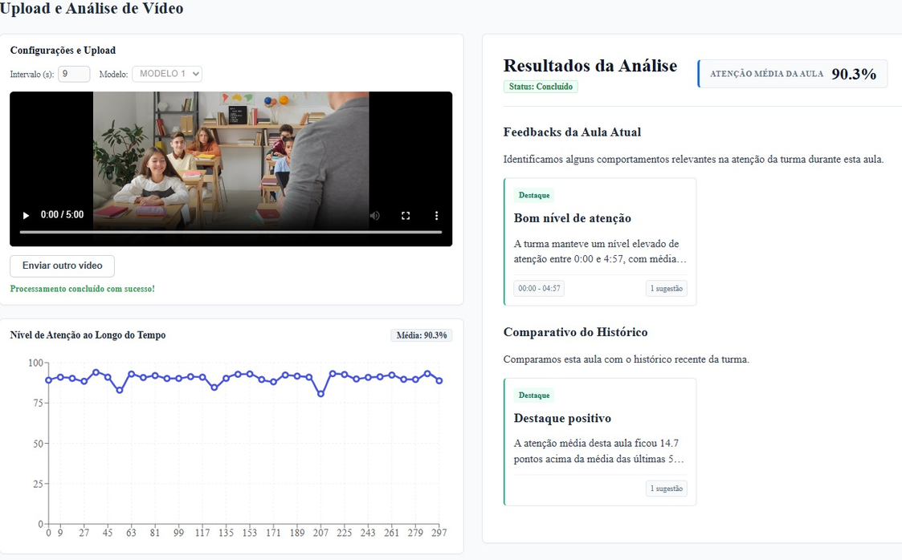
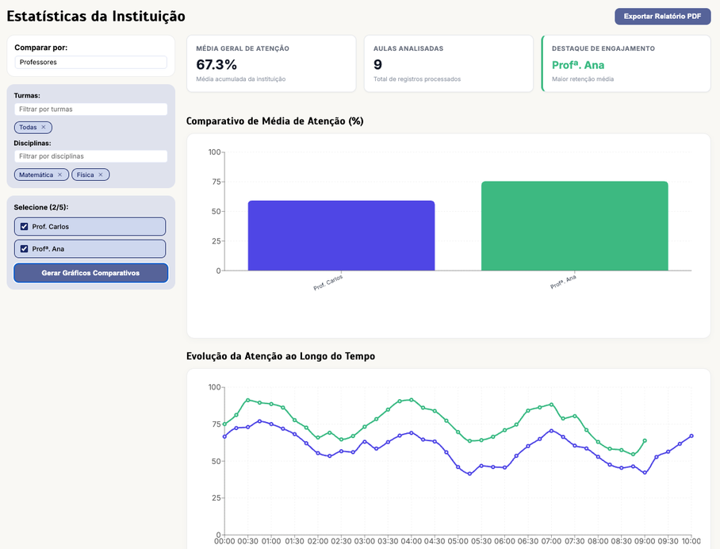

# 🦭 FOCA — Ferramenta de Observação e Classificação de Atenção

> Plataforma de apoio à observação docente que utiliza Visão Computacional para analisar indicadores visuais de atenção em salas de aula.

O **FOCA** é um projeto desenvolvido no **Colégio Técnico de Campinas (COTUCA/UNICAMP)** com o objetivo de auxiliar professores e instituições de ensino na interpretação do comportamento coletivo de estudantes durante aulas presenciais.

A plataforma processa imagens e vídeos de uma turma, detecta os rostos presentes, calcula **índices estimados de atenção**, organiza esses dados ao longo do tempo e apresenta gráficos, feedbacks e recomendações ao professor.


---

## ✨ Principais funcionalidades

- 👥 Detecção de múltiplos rostos em imagens e vídeos;
- 🧠 Cálculo de índices visuais estimados de atenção;
- 📊 Análise temporal da atenção coletiva da turma;
- 📈 Visualização de médias, tendências e comparações entre aulas;
- 💬 Geração automática de feedbacks e recomendações;
- 🕒 Consulta ao histórico de aulas;
- 🏫 Painéis específicos para professores e instituições;
- 📄 Geração de relatórios;

---

## 🛠️ Tecnologias Utilizadas

O FOCA integra diferentes tecnologias para realizar o processamento das mídias, a análise dos indicadores de atenção e a apresentação dos resultados em uma plataforma web.

| Categoria | Tecnologias |
| :--- | :--- |
| **Linguagens** |   |
| **Visão Computacional e IA** |   |
| **Backend** |   |
| **Frontend** |   |
| **Dados e Treinamento** |   |
| **Prototipagem e UI/UX** |   |

---

## 🏗️ Arquitetura

O projeto é dividido principalmente entre:

### Frontend

Responsável pela interface e visualização dos resultados.

**Tecnologias:**
- React
- Recharts
- Figma
- Balsamiq

### Backend

Responsável pelas regras de negócio, gerenciamento dos dados e geração dos feedbacks.

**Tecnologias:**
- Node.js
- API REST
- Banco de dados

### Processamento de Visão Computacional

Responsável pela análise das imagens e vídeos.

**Tecnologias:**
- Python
- FastAPI
- YOLOv8
- OpenCV
- WIDER FACE

---

## 🖥️ Interface

### Análise de uma aula



### Estatísticas de uma Instituição



---

## 🔐 Privacidade

O FOCA foi desenvolvido buscando reduzir a retenção de dados provenientes das gravações.

Os vídeos enviados são utilizados durante o processamento e **descartados após a extração das métricas**.

Para as análises posteriores, são armazenados apenas os dados derivados necessários para a geração dos gráficos, históricos e feedbacks.

---

## 🚀 Executando o projeto

> As instruções abaixo devem ser adaptadas à estrutura atual do repositório.

### Pré-requisitos

- Node.js
- npm
- Python 3
- pip
- Banco de dados utilizado pelo projeto

### Clone o repositório

```bash
git clone <https://github.com/cc24137/FOCA>
cd FOCA
```

### Frontend

```bash
cd <Source/Front-end-web>
npm install
npm run dev
```

### API Node.js

```bash
cd <Source/API>
npm install
npm start
```

### Serviço Python / FastAPI

```bash
cd <Source/AI/src/foca_api_ai>
pip install -r requirements.txt
uvicorn <apiDeVideo.py>:app --reload
```

> Consulte os arquivos de configuração de cada módulo para definir as variáveis de ambiente e conexões necessárias.

---

## 📁 Estrutura do projeto

```text
FOCA/
├── Source/
│   ├── front-end-web/      # Aplicação web
│   ├── API/                # API Node.js e regras de negócio
│   └── AI/                 # Modelos treinados
│       └── src/
│           ├── foca_api_ia # Processamento de visão computacional
│           └── models/     # Modelos treinados
├── documentoss/            # Documentação e imagens
└── README.md
```

---

## 🎓 Seal Workers

O FOCA foi desenvolvido como projeto de pesquisa e desenvolvimento no:

**Colégio Técnico de Campinas — COTUCA**
**Universidade Estadual de Campinas — UNICAMP**

### Autores

- Eduardo Artigiani Lima Tribst
- Júlio Pacheco Stein
- Rafael Fazion Baldin Dias

### Orientação

**Orientadora:** Andreia Cristina de Souza
**Coorientador:** Guilherme de Oliveira Macedo

---

## 📚 Principais referências

- YANG, S. et al. **WIDER FACE: A Face Detection Benchmark.** CVPR, 2016.
- REDMON, J. et al. **You Only Look Once: Unified, Real-Time Object Detection.** CVPR, 2016.
- CANEDO, D.; TRIFAN, A.; NEVES, A. J. R. **Monitoring Students' Attention in a Classroom Through Computer Vision.** Springer, 2018.
- MANDINACH, E. B.; GUMMER, E. S. **A Systemic View of Implementing Data Literacy in Educator Preparation.** Educational Researcher, 2016.

---

## 📄 Licença

Definir a licença do projeto antes da distribuição pública.
